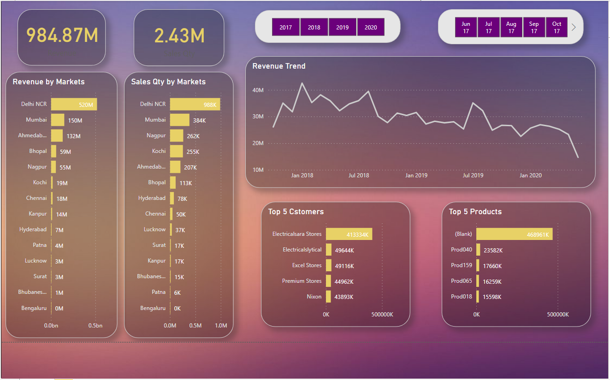

# AtliQ-Hardware-Sales-Insight-Report (MySQL and PowerBI)

This project includes building *Sales Insights Report* of AtliQ Hardware Company.

- *Collecting Sales Revenue Data* - of AtliQ Hardware.
- *Exploratory Data Analysis (EDA)* - Using MySQL
    - Finding Total Sales Revenue and Profit made by company.
    - Finding customers per market
    - Finding Sales Revenue by Markets and many other analyses.
- *Building a Dashboard* - using *PowerBI* to showcase the Sales Insights of the company.
    - Used DAX functions for Data Cleaning and Creating Measues to build charts.

## Dashboard

